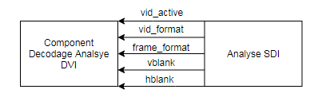

# Sommaire 

[I - Intro](#1)  

[II. Intégration STM32](#2)  

[II. Intégration FPGA](#3)  
[1. Vue Générale](#4)  
[2. Encodage Analyse SDI et DVI](#5)  
[a. Entrée / Sorties](#6)  
[3. Decodage Generation DVI et SDI](#7)  
[a. Entrée / Sorties](#8)  

[III. Trames et registres](#9)  
[1. Trames et registres Analyse DVI](#10)  
[2. Trames et registres Analyse SDI](#11)  
[3. Trames et registres Generation DVI](#12)  
[4. Trames et registres Generation SDI](#13)  
[5. Trames et registres BUS_COM](#14)  

[IV. Comment faire des trames et registres](#15)  
           

# Intégration 

Lorsque les trames et les registres auront étés livrés, on pourra creer deux nouveau groupes pour l'intégration.
On peut séparer l'intégration software en deux grandes parties : STM32 et FPGA

## Intégration STM32 

L'équipe devra d'abord coder :
- Script décodage des trames entrantes 
- Script encodage des trames sortantes

L’équipe fera l’intégration entre :
- Les commandes IHM
- Les Script d’encodage et de décodage
- Les libraires SPI

## Intégration FPGA 

### Vue générale 

L'équipe devra d'abord coder :
- Component décodage des trames entrantes 
- Component encodage des trames sortantes

L’équipe fera l’intégration entre :
- Les commandes Génération/Analyse/BUS_COM
- Les Script d’encodage et de décodage
- Les components SPI

 

### Encodage Analyse SDI et DVI 

#### Entrées / Sorties 

/!\ Seulement partie SDI

Sorties|Description
--------|----------
vid_active| Etat 1 si on reçois un signal
vid_format| Sur 2 bits
frame_format| Sur 3 bits
vblank|
hblank|

## Decodage Generation DVI et SDI 

### Entrées / Sorties 

# Trames et Registres 

## Trames et registres Analyse DVI 

/!\ Non validé

OCTET| NOM| DESCRIPTION
-----|----|-------------
1| Nb_octets| Nombre d’octet de la trame
2| ID_SYS := 2| Système qui émet la commande
3| ID_CMD := 3| Commande qui contient les informations du format vidéo DVI.
4   5| H RESOLUTION| Information sur 16 bits :   - Résolution de la largeur de l’image (en pixels).
6   7| V RESOLUTION| Information sur 16 bits :  - Valeur de résolution de la largeur de l’image en pixels.
8   9| VSYNC| Information sur 16 bits :  - Valeur du temps de la synchro verticale ( en uS )
10   11| HSYNC| Information sur 16 bits :  - Valeur du temps de la synchro horizontale ( en uS ).
12   13| VBLANK| Information sur 16 bits :  - Valeur du temps du blanking vertical ( en uS ).
14   15| HBLANK| Information sur 16 bits :  - Valeur du temps du blanking horizontale ( en uS ).

## Trames et registres Analyse SDI 

OCTET| NOM| DESCRIPTION
-----|-----|------------
1| Nb_octets| Nombre d’octet de la trame
2| ID_SYS := 2| Système qui émet la commande
3| ID_CMD := 1| Commande qui contient les informations de format vidéo et de rafraîchissement SDI.
4| VIDEO FORMAT| Information sur 2 bits :   00 → pas de format détecté   01 → 1280 x 720   10 → 1920 x 1080  
5| FRAME FORMAT| Information sur 3 bits :   000 → pas de détection   001 → 25 fps   010 → 30 fps   011 → 50 fps   111 → 60 fps  
6   7| H BLANK| Information sur 16 bits :   - Temps du blanking horizontal (en uS).
8   9| V BLANK| Information sur 16 bits :   - Temps du blanking vertical (en uS).

OCTET| NOM| DESCRIPTION
-----|-----|------------
1| Nb_octets| Nombre d’octet de la trame
2| ID_SYS := 2| Système qui émet la commande
3| ID_CMD := 2| Commande qui permet de savoir si un flux SDI entrant est détecté ou non.
4| SDI_STATUS| Information sur 1 bit :   0 → Pas de réception vidéo   1 → Réception d’un flux vidéo  

## Trames et resgistres Generation DVI 

OCTET| NOM| DESCRIPTION
-----|----|--------------
1| Nb_octets| Nombre d’octet de la trame
2| ID_SYS := 1| Système qui émet la commande
3| ID_CMD := 1| Commande qui contient les informations du format vidéo DVI à émettre
4   5| H DISP| Information sur 16 bits :  - Résolution de la longueur de l’image (en pixels).
6   7| V DISP| Information sur 16 bits :  - Valeur de résolution de la largeur de l’image (en pixels ).
8   9| H BLANK| Information sur 16 bits :  - Valeur du blanking horizontal (en pixels).
10   11| V BLANK| Information sur 16 bits :  - Valeur du blanking vertical (en pixels).
12| H SYNC| Information sur 8 bits :   - Valeur de la synchro horizontale ( en pixels).
13| V SYNC| Information sur 8 bits :  - Valeur de la synchro verticale ( en pixels).
14   15| PCLK| Horloge de référence de génération. Information sur 16 bits :  - Valeur de l’horloge ( en uS ).
16| MIRE ID| Sélection du type de mire à émettre   Information sur 4 bits :   0000 → Mire barre code   0001 → Mire contour blanc   0010 → Mire green/red   0011 → Mire horizontalBandMire   0100 → Mire horizontalShadeGray   0101 → Mire PatchWork   0110 → Mire RectShadesGray   0111 → Mire SwitchBlackWhite   1000 → Mire VerticalBlandMire   1001 → Mire VerticalShadesGray  

### Trames et registres Generation SDI 

En cours...

### Trames et registres BUS_COM 

Octet | Nom  | Description
------|------|-------------
1|Nb_Octets|Nombre d’octets de la trame
2|ID_Sys|Système dont la commande est sollicité
3|ID_Cmd|Commande sollicité
4|Type_bus|Type de bus utilisé :  0x1 : SPI   0x2 : I2C   0x3 : UART
5|Adresse|Adresse de l'esclave (pour I2C)
6|Taille_mot|Taille du mot seul à transmettre en octet (hors spécification de taille ou fréquence)
7|Operateur|Nature de l'opérateur du facteur de bauds.   0x0 pour multiplication   0x1 pour division
8|Facteur_baud|Facteur (multiple de 9 600) du baud rate de transmission.   **Dans le cas où Operateur = 0x0, la valeur de Facteur_baud multiplie 9 600   Dans le cas où Operateur = 0x1, la valeur de Facteur_baud divise 9 600.**  _Exemple :   Operateur = 1; Facteur_baud = 0x20 (32) ==> Bauds = 300   Operateur = 0; Facteur_baud = 0x68 (104) ==> Bauds = 998 400_
9 ou plus|Mot|Mot à transmettre (dépend de Taille_mot)

# Calendrier des livraisons

# Comment faire les trames et registres ? 

## Trames

Les informations seront transmises via des trames composés en octet.
Chaque octet ou groupe d'octet dans la trame sera assigné, selon la partie, à une information.

Chaque groupe devra établir à quoi correspond chaque octet de leur trame.

Le début de chaques trames sera imposé pour tout les groupes :

Octet | Nom  | Description
-----|------|-------------
1|Nb_Octets| Nombre d’octets de la trame
2|ID_Sys| Système dont la commande est sollicité
3|ID_Cmd| Commande sollicité

Exemple de trame pour le groupe génération :

Octet | Nom  | Description
-----|------|-------------
1|Nb_Octets| Nombre d’octets de la trame
2|ID_Sys| Système dont la commande est sollicité
3|ID_Cmd| Commande sollicité
4|Type_mire| Type de mire
5 6| Resolution_X | Résolution sur l'axe X
7 8| Resolution_Y | Résolution sur l'axe Y

## Registres

Chaque composantes de la trame d'un groupe qui contien un élément de paramètre fixe (comme une fonction) aura un registre associé.

Registres ID_Sys :

Nom  | Valeur
-----|-------------
STM32 | 0x1
FPGA_Generation | 0x2
FPGA_Analyse| 0x3
FPGA_BUS_COM|0x4
