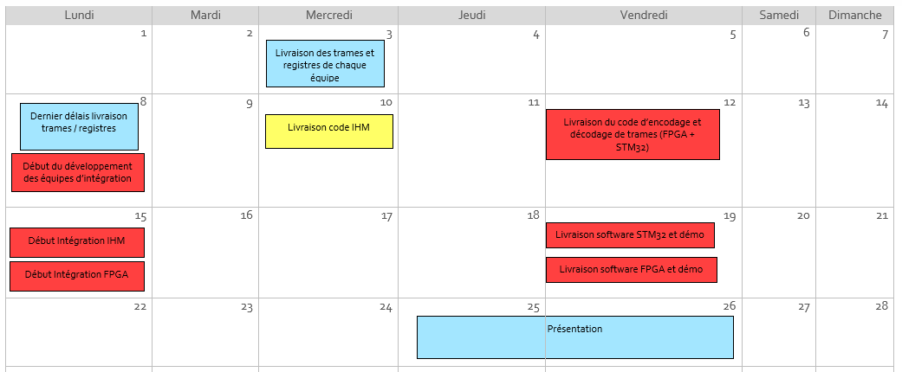

# Trames et registres

## Trames

Les informations seront transmises via des trames composés en octet.
Chaque octet ou groupe d'octet dans la trame sera assigné, selon la partie, à une information.

Chaque groupe devra établir à quoi correspond chaque octet de leur trame.

Le début de chaques trames sera imposé pour tout les groupes :

Octet | Nom  | Description
-----|------|-------------
1|Nb_Octets| Nombre d’octets de la trame
2|ID_Sys| Système dont la commande est sollicité
3|ID_Cmd| Commande sollicité

Exemple de trame pour le groupe génération :

Octet | Nom  | Description
-----|------|-------------
1|Nb_Octets| Nombre d’octets de la trame
2|ID_Sys| Système dont la commande est sollicité
3|ID_Cmd| Commande sollicité
4|Type_mire| Type de mire
5 6| Resolution_X | Résolution sur l'axe X
7 8| Resolution_Y | Résolution sur l'axe Y

## Registres

Chaque composantes de la trame d'un groupe qui contien un élément de paramètre fixe (comme une fonction) aura un registre associé.

Registres ID_Sys :

Nom  | Valeur
-----|-------------
STM32 | 0x1
FPGA_Analyse | 0x2
FPGA_Generation| 0x3

# Intégration

Lorsque les trames et les registres auront étés livrés, on pourra creer deux nouveau groupes pour l'intégration.
On peut séparer l'intégration software en deux grandes parties : STM32 et FPGA

## Intégration STM32

L'équipe devra d'abord coder :
- Script décodage des trames entrantes 
- Script encodage des trames sortantes

L’équipe fera l’intégration entre :
- Les commandes IHM
- Les Script d’encodage et de décodage
- Les libraires SPI

## Intégration FPGA

L'équipe devra d'abord coder :
- Component décodage des trames entrantes 
- Component encodage des trames sortantes

L’équipe fera l’intégration entre :
- Les commandes Génération/Analyse/BUS_COM
- Les Script d’encodage et de décodage
- Les components SPI

# Test et démo

# Calendrier des livraisons

